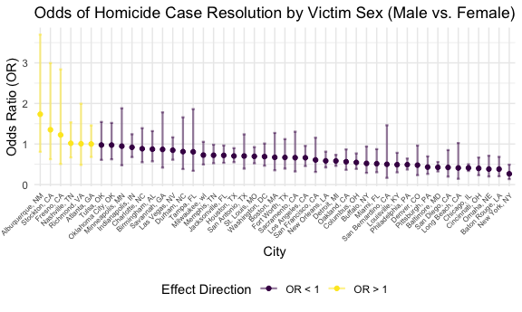
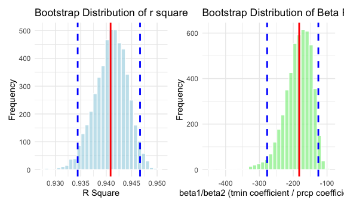
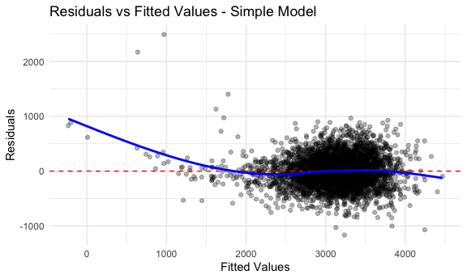
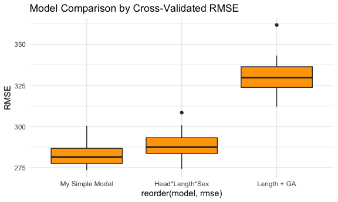

p8105_hw6_lq2250
================
Lanlan_Qing
2025-12-02

## Initial Settings

``` r
library(tidyverse)
library(modelr)
library(broom)
library(mgcv)
library(ggplot2)

knitr::opts_chunk$set(
  fig.width = 6,
  fig.asp = .6,
  out.width = "90%"
)

theme_set(theme_minimal() + theme(legend.position = "bottom"))

options(
  ggplot2.continuous.colour = "viridis",
  ggplot2.continuous.fill = "viridis"
)

scale_colour_discrete = scale_colour_viridis_d
scale_fill_discrete = scale_fill_viridis_d
```

## Problem 1

``` r
# Import dataset and cleaning

homicide_df = 
  read_csv("data/homicide-data.csv") |> 
  mutate(city_state = str_c(city, ", ", state),
         resolved = as.numeric(disposition == "Closed by arrest")) |>
  filter(!city_state %in% c("Dallas, TX", "Phoenix, AZ", "Kansas City, MO", "Tulsa, AL")) |>
  mutate(victim_age = as.numeric(victim_age)) |>
  select(-city, -state, -disposition) |>
  relocate(city_state, .after = victim_sex) |>
  drop_na()
```

    ## Rows: 52179 Columns: 12
    ## ── Column specification ────────────────────────────────────────────────────────
    ## Delimiter: ","
    ## chr (9): uid, victim_last, victim_first, victim_race, victim_age, victim_sex...
    ## dbl (3): reported_date, lat, lon
    ## 
    ## ℹ Use `spec()` to retrieve the full column specification for this data.
    ## ℹ Specify the column types or set `show_col_types = FALSE` to quiet this message.

    ## Warning: There was 1 warning in `mutate()`.
    ## ℹ In argument: `victim_age = as.numeric(victim_age)`.
    ## Caused by warning:
    ## ! NAs introduced by coercion

``` r
# Select race of white and black
homicide_race = homicide_df |>
  filter(victim_race %in% c("Black", "White"))

# Select city of Baltimore
baltimore_df = homicide_race |>
  filter(str_detect(city_state, "MD")) |>
  select(resolved, victim_age, victim_race, victim_sex)

# Logistic Linear Regression data of Baltimore
fit_logistic_md = 
  baltimore_df |> 
  glm(resolved ~ victim_age + victim_race + victim_sex, family = binomial(), data = _) |>
  broom::tidy(conf.int = TRUE)

# Logistic Linear Regression output and summary of Baltimore
fit_logistic_md |> 
  filter(str_detect(term, "Male")) |>
  mutate(OR = exp(estimate),
         OR_lower = exp(conf.low),
         OR_higher = exp(conf.high)) 
```

    ## # A tibble: 1 × 10
    ##   term   estimate std.error statistic  p.value conf.low conf.high    OR OR_lower
    ##   <chr>     <dbl>     <dbl>     <dbl>    <dbl>    <dbl>     <dbl> <dbl>    <dbl>
    ## 1 victi…   -0.854     0.138     -6.18 6.26e-10    -1.13    -0.584 0.426    0.324
    ## # ℹ 1 more variable: OR_higher <dbl>

``` r
fit_logistic_md |> knitr::kable(digits = 3)
```

| term             | estimate | std.error | statistic | p.value | conf.low | conf.high |
|:-----------------|---------:|----------:|----------:|--------:|---------:|----------:|
| (Intercept)      |    0.310 |     0.171 |     1.810 |   0.070 |   -0.025 |     0.648 |
| victim_age       |   -0.007 |     0.003 |    -2.024 |   0.043 |   -0.013 |     0.000 |
| victim_raceWhite |    0.842 |     0.175 |     4.818 |   0.000 |    0.501 |     1.187 |
| victim_sexMale   |   -0.854 |     0.138 |    -6.184 |   0.000 |   -1.126 |    -0.584 |

``` r
# Fit for all cities
fit_logistic = homicide_race |> 
  select(city_state, resolved, victim_age, victim_race, victim_sex) |> 
  nest(data = -city_state) |>
  mutate(models = map(data, \(df)glm(resolved ~ victim_age + victim_race + victim_sex,family = binomial(), data = df)),
         results = map(models, \(mod)broom::tidy(mod, conf.int = TRUE))) |>
  select(-models, -data) |>
  unnest(results)
```

    ## Warning: There were 43 warnings in `mutate()`.
    ## The first warning was:
    ## ℹ In argument: `results = map(models, function(mod) broom::tidy(mod, conf.int =
    ##   TRUE))`.
    ## Caused by warning:
    ## ! glm.fit: fitted probabilities numerically 0 or 1 occurred
    ## ℹ Run `dplyr::last_dplyr_warnings()` to see the 42 remaining warnings.

``` r
# Create dataframe with ORs and Cls
fit_logistic = 
  fit_logistic |> 
  filter(str_detect(term, "Male")) |>
  group_by(city_state) |>
  mutate(OR = exp(estimate),
         OR_lower = exp(conf.low),
         OR_higher = exp(conf.high)) |>
  select(city_state, OR, OR_lower, OR_higher)

fit_logistic |> knitr::kable()
```

| city_state         |        OR |  OR_lower | OR_higher |
|:-------------------|----------:|----------:|----------:|
| Albuquerque, NM    | 1.7339831 | 0.8075805 | 3.6955290 |
| Atlanta, GA        | 1.0000771 | 0.6803477 | 1.4582575 |
| Baltimore, MD      | 0.4255117 | 0.3241908 | 0.5575508 |
| Baton Rouge, LA    | 0.3814393 | 0.2043481 | 0.6836343 |
| Birmingham, AL     | 0.8728980 | 0.5732247 | 1.3183107 |
| Boston, MA         | 0.6716785 | 0.3521333 | 1.2727518 |
| Buffalo, NY        | 0.5224049 | 0.2894542 | 0.9391367 |
| Charlotte, NC      | 0.8838976 | 0.5507440 | 1.3905954 |
| Chicago, IL        | 0.4100982 | 0.3361233 | 0.5008546 |
| Cincinnati, OH     | 0.3998277 | 0.2313767 | 0.6670456 |
| Columbus, OH       | 0.5460604 | 0.3860788 | 0.7683178 |
| Denver, CO         | 0.4790620 | 0.2327380 | 0.9624974 |
| Detroit, MI        | 0.5823472 | 0.4619454 | 0.7335458 |
| Durham, NC         | 0.8123514 | 0.3824420 | 1.6580169 |
| Fort Worth, TX     | 0.6689803 | 0.3935128 | 1.1211603 |
| Fresno, CA         | 1.2239928 | 0.5066492 | 2.8393553 |
| Houston, TX        | 0.7049094 | 0.5519412 | 0.8983052 |
| Indianapolis, IN   | 0.9187284 | 0.6784616 | 1.2413059 |
| Jacksonville, FL   | 0.7198144 | 0.5359236 | 0.9650986 |
| Las Vegas, NV      | 0.8469656 | 0.6126105 | 1.1649175 |
| Long Beach, CA     | 0.4102163 | 0.1427304 | 1.0241775 |
| Los Angeles, CA    | 0.6618816 | 0.4565014 | 0.9541036 |
| Louisville, KY     | 0.4905546 | 0.3014879 | 0.7836391 |
| Memphis, TN        | 0.7232194 | 0.5261210 | 0.9835973 |
| Miami, FL          | 0.5152379 | 0.3040214 | 0.8734480 |
| Milwaukee, wI      | 0.7271327 | 0.4951325 | 1.0542297 |
| Minneapolis, MN    | 0.9469587 | 0.4759016 | 1.8809745 |
| Nashville, TN      | 1.0175115 | 0.6674709 | 1.5351249 |
| New Orleans, LA    | 0.5849373 | 0.4218807 | 0.8121787 |
| New York, NY       | 0.2658250 | 0.1343803 | 0.4918642 |
| Oakland, CA        | 0.5630819 | 0.3637421 | 0.8671086 |
| Oklahoma City, OK  | 0.9740747 | 0.6228507 | 1.5199721 |
| Omaha, NE          | 0.3824861 | 0.1988357 | 0.7109316 |
| Philadelphia, PA   | 0.4904447 | 0.3711840 | 0.6428412 |
| Pittsburgh, PA     | 0.4307528 | 0.2626022 | 0.6955518 |
| Richmond, VA       | 1.0060520 | 0.4834671 | 1.9936248 |
| San Antonio, TX    | 0.7046200 | 0.3928179 | 1.2382509 |
| Sacramento, CA     | 0.6631647 | 0.3234019 | 1.3036884 |
| Savannah, GA       | 0.8669817 | 0.4185827 | 1.7802453 |
| San Bernardino, CA | 0.5003444 | 0.1655367 | 1.4623977 |
| San Diego, CA      | 0.4225476 | 0.1956636 | 0.8501869 |
| San Francisco, CA  | 0.6075362 | 0.3116925 | 1.1551470 |
| St. Louis, MO      | 0.6964146 | 0.5243956 | 0.9235095 |
| Stockton, CA       | 1.3517273 | 0.6256427 | 2.9941299 |
| Tampa, FL          | 0.8077029 | 0.3395253 | 1.8598834 |
| Tulsa, OK          | 0.9757694 | 0.6090664 | 1.5439356 |
| Washington, DC     | 0.6901713 | 0.4653608 | 1.0122516 |

``` r
# Create plot

fit_logistic |>
  ggplot(aes(x = fct_reorder(city_state, OR, .desc = TRUE),
             y = OR,
             ymin = OR_lower,
             ymax = OR_higher,
             color = ifelse(OR > 1, "OR > 1", "OR < 1"))) +
  geom_errorbar(width = 0.3,
                linewidth = 0.8,
                alpha = 0.5) +
  geom_point() +
  labs(
    x = "City",
    y = "Odds Ratio (OR)",
    title = "Odds of Homicide Case Resolution by Victim Sex (Male vs. Female)",
    color = "Effect Direction"
  ) +
  theme(axis.text.x = element_text(angle = 45, hjust = 1, size = 6))
```



## Problem 2

``` r
# Import data
library(p8105.datasets)
library(patchwork)
data("weather_df")
```

``` r
# Bootstrap samples
data_clean = weather_df |>
  select(tmax, tmin, prcp) |>
  drop_na()

set.seed(123)
bootstraps = modelr::bootstrap(data_clean, 5000)

# Calculate statistics for each sample
boot_results = bootstraps |>
  mutate(
    # Regression model
    model = map(strap, ~ lm(tmax ~ tmin + prcp, data = as_tibble(.x))),
    # extract r_squared by broom::glance
    glance_df = map(model, broom::glance),
    r_squared = map_dbl(glance_df, "r.squared"),
    # calculate ratio
    tidy_df = map(model, tidy),
    beta_ratio = map_dbl(tidy_df, function(df) {
      beta_tmin = df$estimate[df$term == "tmin"]
      beta_prcp = df$estimate[df$term == "prcp"]
      beta_tmin / beta_prcp
    })
  ) |>
  select(r_squared, beta_ratio)

# calculate 95% confidence interval
ci_r2 = quantile(boot_results$r_squared, probs = c(0.025, 0.975))
ci_ratio = quantile(boot_results$beta_ratio, probs = c(0.025, 0.975), na.rm = TRUE)

# original model
original_model = lm(tmax ~ tmin + prcp, data = data_clean)
original_r2 = summary(original_model)$r.squared
original_coefs = coef(original_model)
original_ratio = original_coefs["tmin"] / original_coefs["prcp"]

# r square distribution
p1 = ggplot(boot_results, aes(x = r_squared)) +
  geom_histogram(fill = "lightblue", color = "white", alpha = 0.7) +
  geom_vline(xintercept = original_r2, color = "red", size = 1) +
  geom_vline(xintercept = ci_r2, color = "blue", linetype = "dashed", size = 1) +
  labs(
    title = "Bootstrap Distribution of r square",
    x = "R Square",
    y = "Frequency"
  ) +
  theme_minimal()
```

    ## Warning: Using `size` aesthetic for lines was deprecated in ggplot2 3.4.0.
    ## ℹ Please use `linewidth` instead.
    ## This warning is displayed once every 8 hours.
    ## Call `lifecycle::last_lifecycle_warnings()` to see where this warning was
    ## generated.

``` r
# Ratio plot
p2 = ggplot(boot_results %>% drop_na(beta_ratio), aes(x = beta_ratio)) +
  geom_histogram(fill = "lightgreen", color = "white", alpha = 0.7) +
  geom_vline(xintercept = original_ratio, color = "red", size = 1) +
  geom_vline(xintercept = ci_ratio, color = "blue", linetype = "dashed", size = 1) +
  labs(
    title = "Bootstrap Distribution of Beta Ratio (tmin/prcp)",
    x = "beta1/beta2 (tmin coefficient / prcp coefficient)",
    y = "Frequency"
  ) +
  theme_minimal()

# print the final plot
print(p1 + p2)
```

    ## `stat_bin()` using `bins = 30`. Pick better value `binwidth`.
    ## `stat_bin()` using `bins = 30`. Pick better value `binwidth`.



## Problem 3

``` r
# Import and Clean the data
birthweight = read_csv("data/birthweight.csv", na = c("NA", "", ".")) |> 
  janitor::clean_names() |>
  mutate(
    babysex = factor(babysex, labels = c("male", "female")),
    malform = factor(malform, labels = c("absent", "present"))
  ) |> 
  drop_na()
```

    ## Rows: 4342 Columns: 20
    ## ── Column specification ────────────────────────────────────────────────────────
    ## Delimiter: ","
    ## dbl (20): babysex, bhead, blength, bwt, delwt, fincome, frace, gaweeks, malf...
    ## 
    ## ℹ Use `spec()` to retrieve the full column specification for this data.
    ## ℹ Specify the column types or set `show_col_types = FALSE` to quiet this message.

``` r
# Build simple model using key variables: fetal size and basic maternal factors
my_model = lm(bwt ~ bhead + blength + gaweeks + delwt + smoken, 
              data = birthweight)

summary(my_model)
```

    ## 
    ## Call:
    ## lm(formula = bwt ~ bhead + blength + gaweeks + delwt + smoken, 
    ##     data = birthweight)
    ## 
    ## Residuals:
    ##      Min       1Q   Median       3Q      Max 
    ## -1165.34  -185.08    -9.88   175.80  2490.16 
    ## 
    ## Coefficients:
    ##               Estimate Std. Error t value Pr(>|t|)    
    ## (Intercept) -6222.7260    95.4628 -65.185  < 2e-16 ***
    ## bhead         135.3264     3.4987  38.679  < 2e-16 ***
    ## blength        78.6666     2.0742  37.926  < 2e-16 ***
    ## gaweeks        14.5726     1.4926   9.763  < 2e-16 ***
    ## delwt           2.0911     0.1996  10.478  < 2e-16 ***
    ## smoken         -2.2631     0.5824  -3.886 0.000104 ***
    ## ---
    ## Signif. codes:  0 '***' 0.001 '**' 0.01 '*' 0.05 '.' 0.1 ' ' 1
    ## 
    ## Residual standard error: 282.3 on 4336 degrees of freedom
    ## Multiple R-squared:  0.6965, Adjusted R-squared:  0.6961 
    ## F-statistic:  1990 on 5 and 4336 DF,  p-value: < 2.2e-16

``` r
# Residual plot
birthweight |> 
  add_predictions(my_model) |> 
  add_residuals(my_model) |> 
  ggplot(aes(x = pred, y = resid)) +
  geom_point(alpha = 0.3) +
  geom_hline(yintercept = 0, color = "red", linetype = "dashed") +
  geom_smooth(se = FALSE, color = "blue") +
  labs(
    title = "Residuals vs Fitted Values - Simple Model",
    x = "Fitted Values",
    y = "Residuals"
  ) +
  theme_minimal()
```

    ## `geom_smooth()` using method = 'gam' and formula = 'y ~ s(x, bs = "cs")'



``` r
# Two comparison models
model1 = lm(bwt ~ blength + gaweeks, data = birthweight)
model2 = lm(bwt ~ bhead * blength * babysex, data = birthweight)

# Cross-validation comparison
set.seed(123)
cv_data = birthweight |> 
  crossv_mc(n = 50, test = 0.2)  # Reduced to 50 CV iterations

# Calculate RMSE for each model
cv_results = cv_data |> 
  mutate(
    my_model = map(train, ~lm(bwt ~ bhead + blength + gaweeks + delwt + smoken, data = .x)),
    model1 = map(train, ~lm(bwt ~ blength + gaweeks, data = .x)),
    model2 = map(train, ~lm(bwt ~ bhead * blength * babysex, data = .x))
  ) |> 
  mutate(
    rmse_my = map2_dbl(my_model, test, ~rmse(.x, .y)),
    rmse_1 = map2_dbl(model1, test, ~rmse(.x, .y)),
    rmse_2 = map2_dbl(model2, test, ~rmse(.x, .y))
  )

# 6. Results summary
cv_summary = cv_results |> 
  summarise(
    my_model = mean(rmse_my),
    length_ga = mean(rmse_1),
    head_length_sex = mean(rmse_2)
  )

# Visualization comparison
cv_results |> 
  select(rmse_my, rmse_1, rmse_2) |> 
  pivot_longer(everything(), names_to = "model", values_to = "rmse") |> 
  mutate(model = case_when(
    model == "rmse_my" ~ "My Simple Model",
    model == "rmse_1" ~ "Length + GA",
    model == "rmse_2" ~ "Head*Length*Sex"
  )) |> 
  ggplot(aes(x = reorder(model, rmse), y = rmse)) +
  geom_boxplot(fill = "orange") +
  labs(
    title = "Model Comparison by Cross-Validated RMSE",
    y = "RMSE"
  ) +
  theme_minimal()
```


